# 第1章 前言  

* 核心技术：Typescript + React 
* 核心框架：Redux
* 核心思想：组件化
* 核心案例：仿携程旅游电商购物平台
  * 软件开发生命周期
  * 测试
  * 容器化部署
  * 阿里云上线

# 第2章 一些前置知识点

## Typescript

### **创建ts项目？**

```
npx create-react-app my-app-ts --template typescript
```

### **tsconfig.json详解**

* ts编译器：ts-loader、awesome-typescript-loader以及babel-loader
* 编译器配置文件：tsconfig.json

```json
{
  "compilerOptions": {
    "noImplicitAny": false, // 不需要显式地声明变量的类型any
    "target": "es5", // 编译后的目标javascript版本,ES5, ES6/ES2015, ES2016, ES2017, ES2018, ES2019, ES2020, ESNext
    "lib": [
      "dom", // document.getElementById("root")
      "dom.iterable",
      "esnext"
    ],
    "allowJs": true, // 允许混合编译JavaScript文件 
    "skipLibCheck": true,
    "esModuleInterop": true, // 允许我们使用commonjs的方式import默认文件,  import React from 'react'  
    // "esModuleInterop": false, import * as React from 'react'
    "allowSyntheticDefaultImports": true,
    "strict": true,
    "forceConsistentCasingInFileNames": true,
    "noFallthroughCasesInSwitch": true,
    "module": "esnext", // 配置的是我们代码的模块系统, Node.js的CommonJS、ES6标准的esnext、requirejs的AMD
    "moduleResolution": "node", // 决定了我们编译器的工作方式，"node" and "classic"(已弃用)
    "resolveJsonModule": true,
    "isolatedModules": true, // 编译器会将每个文件作为单独的模块来使用
    "noEmit": true, // 表示当发生错误的时候，编译器不要生成 JavaScript 代码
    "jsx": "react" // 允许编译器支持编译react代码
  },
  "include": [
    "src"
  ]
}
```

### **为已存在的项目添加ts支持？**

先`npm install --save typescript @types/node @types/react @types/react-dom @types/jest`

* @types/react: react ts接口定义（也称typing）

然后将jsx文件改为tsx，再npm start打开即可

## React

### **理解组件化**

* 组件化就是把网页拆成若干个独立的模块
* 可以被轻易复制和管理
* 诞生了Angular（二代以上）、ReactJS、VueJS
* 也诞生了Flex,Redux,Mobx,Immutable,Observale(RxJS)等一系列状态管理思想

### **React的设计理念**

* 单向数据流
  * 数据与界面绑定
  * 单向渲染
  * 就好像一个函数，同样的输入，同样的输出
* 虚拟DOM
  * 类似Docker或VMware的Snapshot快照技术
  * 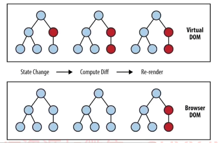
* 组件化
  * 保持交互一致性
  * 保持视觉风格的统一
  * 便于程序员互相之间的协作

**React函数式组件**

```jsx
import React from 'react'
const Robot = () => {
  return <></>  
};
export default Robot;
```

```tsx
import React from "react";

interface RobotProps{
  id:string,
  name:string,
}

const Robot: React.FC<RobotProps> = ({id,name})=>{
  return<li>
    <span>id</span>
  </li>
}

export default Robot;
```

### **如何在JSX中防止注入攻击**

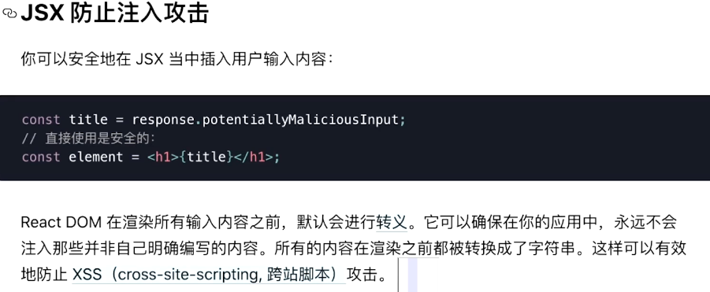

* 使用花括号直接渲染内容的时候，React会自动转义

* JSX无法避免“传入函数”的黑客攻击，eg：

  ```jsx
  const jsHacked = "javascript:alert('You have been Hacked');"
  
  function App(){
    return(
      <a href={jsHacked}>My websit url</a>
    )
  }
  ```

  当点击这个url时，网站就被黑了

  如何防范：推荐书《Javascript王者归来》

### TSX

* 文件扩展名 .tsx

* 在配置文件tsconfig.json中启用jsx选项

  ```json
  "jsx":"react";//有五种模式可选
  ```

  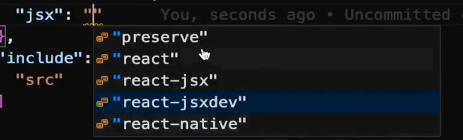

### 配置React的CSS Module

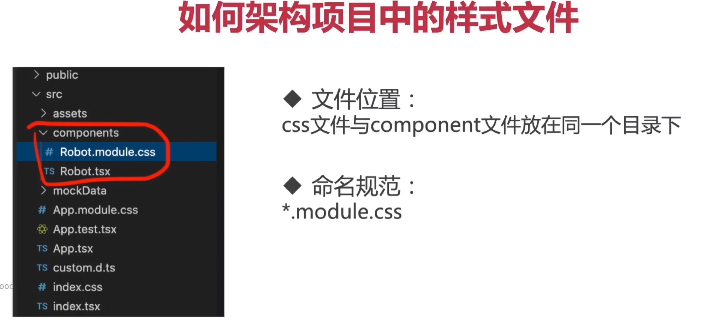

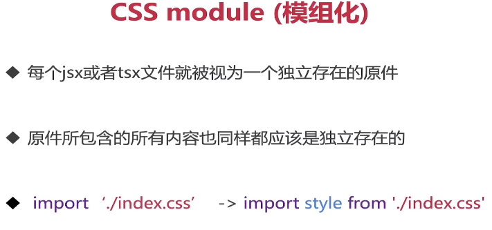

注：直接在.tsx文件中使用`import styles from './App.css'`的方式引入CSS无法成功，因为ts无法试别css文件。所以需要给CSS文件加上类型定义声明。

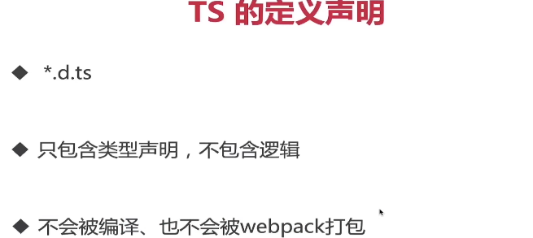

具体做法：在src下创建`custome.d.ts`，加入对CSS文件引用对象化的支持

```typescript
declare module "*.css"{
    const css:{[key:string]:string};
    export default css;
}
```

然后ts就可以识别css了

```tsx
import styles from './App.module.css'

function App(){
  return(
    <div className={styles.app}>
      {/* content */}
    </div>
  )
}

```

**小结：引入css的方法**

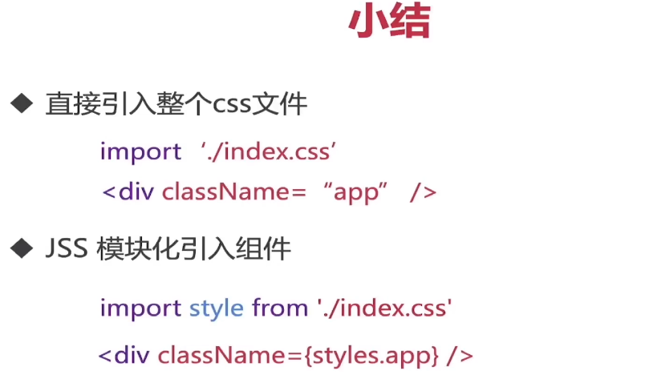

### CSS in JS(JSS)

**JSS是什么？**

React 对 CSS 封装非常简单，就是沿用了 DOM 的 style 属性对象。CSS-in-JS是一种技术（technique），而不是一个具体的库实现（library）。**简单来说CSS-in-JS就是将应用的CSS样式写在JavaScript文件里面，而不是独立为一些.css，.scss或者less之类的文件，这样你就可以在CSS中使用一些属于JS的诸如模块声明，变量定义，函数调用和条件判断等语言特性来提供灵活的可扩展的样式定义。****

**JSS 的常见实现**

由于React 对 CSS 的封装非常弱，导致出现了一系列的第三方库，用来加强 React 的 CSS 操作。它们统称为 CSS in JS，意思就是使用 JS 语言写 CSS。

1. **Styled-components**
2. **使用模块化css**

**JSS好处与坏处**

好处：

1. 局部样式
2. 避免无用的css样式堆积
3. 封装的更好的组件库

坏处：

1. 运行时消耗
2. 代码可读性差
3. 没有统一的业界标准

### 在React项目中使用模块化CSS实现JSS

首先，安装插件`typescript-plugin-css-modules`解析css文件并生成ts对应的引用类型

```bash
npm install typescript-plugin-css-modules --save-dev
```

【注】：只在开发时使用，所以安装在dev中 

安装后package.json中如图所示：

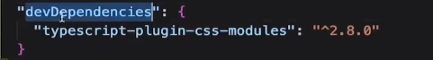

然后，在tsconfig.json中的写到plugins数组中

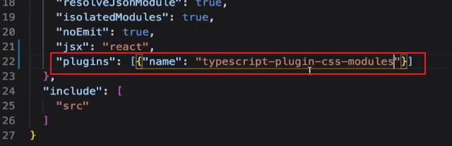

最后，对于vscode有一个特殊配置（就是配置ts的sdk)，`.vscode`文件夹下配置settigs.json，内容如下：

```json
{
    "typescript.tsdk":"node_modules/typescript/lib",
    "typescript.enablePropmtUseWorkspaceTsdk":true
}
```

配置好后，如此一来我们便能在项目中使用JSS并且有智能提示

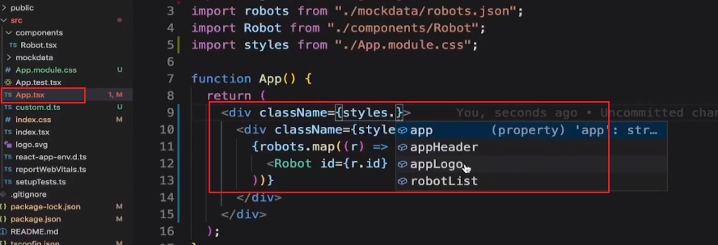

  ### 加载媒体与字体文件

**媒体资源**

静态资源保存在统一的文件夹assets中，svg，png，jpeg等直接引用即可

**字体文件**

因为字体是全局样式，所以在index.css中添加字体样式

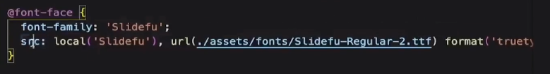

  ### setState的异步开发

<font color=yellow>setState() 异步更新，同步执行：</font>setState()本身并非异步，但对state的处理机制给人一种异步的假象，state处理一般发生在生命周期变化的时候。

  ### React组件的生命周期

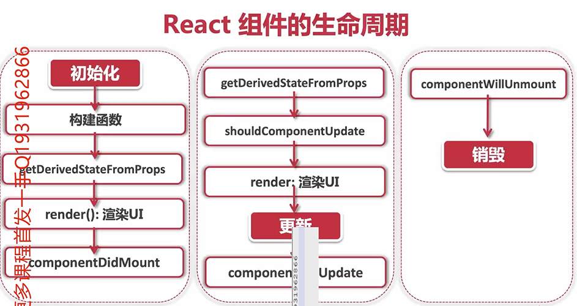

  ### React 17 版本变化

**breaking changes**

* 事件委托机制改变
* 向原生浏览器靠拢
* 删除事件池
* useEffect清理操作改为异步操作
* JSX不可反悔undefined
* 删除部分私有API

# 第4章 【基础篇】React Hooks11 节 | 83分钟

  本章将会基于react hooks 继续完成购物车组件，并通过函数式组件来学习hooks相关知识与技巧。

  收起列表

  ##：*4-1 带着问题来学习
  ##：*4-2 【概念理解】 什么是钩子(hooks) (09:14)
  ##：*4-3 【状态钩子】使用useState管理组件state (08:01)
  ##：*4-4 【概念理解】副作用 side effect (05:31)
  ##：*4-5 【副作用钩子】使用useEffect异步获取数据 (10:43)
  ##：*4-6 【副作用钩子】useEffect 使用指南 (10:35)
  ##：*4-7 【全局数据传递】Context 与 useContext (07:23)
  ##：*4-8 【全局数据传递】组件化Context Provider (13:09)
  ##：*4-9 【高阶组件HOC】withAddToCart() (11:24)
  ##：*4-10 【自定义Hook】useAddToCart() (06:31)

  - *作业：*4-11 【讨论题】React Hooks 深度分析

# 第5章 【实战项目】项目搭建与首页开发 **试看**9 节 | 69分钟

  掌握基础概念以后就可以正式进入课程的实战演练部分。本章，我们将会搭建实战项目，从整体上学习实战项目的结构、学习如何给项目划分功能模块、并且学会如何更合理的配置前端项目。实战项目中也将全面使用react hooks。

  收起列表

  ##：*5-1 带着问题来学习
  ##：*5-2 【项目规划】网站开发设计指南 (09:43)
  ##：*5-3 【项目启动】系统设计与项目初始化 (08:45)
  ##：*5-4 【主页开发】Header、Footer (16:03)
  ##：*5-5 【项目重构】组件化思想实践 (05:50)
  ##：*5-6 【主页开发】走马灯与侧边栏多重菜单 (12:53)**试看**
  ##：*5-7 【主页开发】热门产品推荐 (13:46)
  ##：*5-8 【实战任务】开发合作企业组件 (01:49)
  - *作业：*5-9 【讨论题】软件开发生命周期

# 第6章 【路由系统】React Router Dom8 节 | 57分钟

  构建和优化一个合理的路由架构是前端攻城狮必须掌握的技能。在本章中，课程会以react-router-dom为例，学会如何使用组件化的思想搭建一个简单、高效、可拓展的路由系统。

  收起列表

  ##：*6-1 带着问题来学习
  ##：*6-2 【概念理解】路由与SPA (06:27)
  ##：*6-3 【路由初始化】配置react-router (12:10)
  ##：*6-4 【路由架构】基础路由系统 (09:04)
  ##：*6-5 【路由搭建】页面导航 (14:17)
  ##：*6-6 【路由搭建】withRouter 与 useRouter (10:47)
  ##：*6-7 【路由搭建】Link 与动态导航 (03:49)
  - *作业：*6-8 【讨论题】组件究竟是什么？

# 第7章 【Redux 入门】实战项目架构设计11 节 | 118分钟

  redux是目前react中最流行的架构模式，本章将会通过网站的i18n国际化语言切换为案例，一步一步学会如何创建状态仓库store、如何实现store的链接与订阅、如何拆分合并reducer，以及如何统一管理action。除此以外，我们还会学习如何使用TypeScript来处理redux相关代码的强类型定义。...

  收起列表

  ##：*7-1 带着问题来学习
  ##：*7-2 【概念理解】什么是redux？ (12:15)
  ##：*7-3 【创建state】createStore (13:04)
  ##：*7-4 【访问state】获取store数据 (07:27)
  ##：*7-5 【更新state】Action与Reducer处理 (11:50)
  ##：*7-6 【订阅state】store的连接与订阅 (09:59)
  ##：*7-7 【i18n】完成网站语言切换 (22:14)
  ##：*7-8 【redux重构】action 的拆分与统一 (14:24)
  ##：*7-9 【redux封装】在类组件中使用react-redux (15:39)
  ##：*7-10 【redux封装】在函数式组建中使用react-redux (10:52)
  - *作业：*7-11 【讨论题】redux 深度分析

# 第8章 【进击的Redux】异步AJAX与redux中间件10 节 | 88分钟

  前后端分离架构是目前网站开发的主流技术，本章我们将会学习如何在react项目中通过AJAX进行http数据访问，并通过redex-thunk来完成redux架构中异步action的处理方法。

  收起列表

  ##：*8-1 带着问题来学习
  ##：*8-2 【概念理解】RESTful (09:08)
  ##：*8-3 【API说明】课程后端在哪里？
  ##：*8-4 【API连接】AJAX 异步获取推荐数据 (16:13)
  ##：*8-5 【概念理解】Redux vs MVC (06:09)
  ##：*8-6 【reducer管理】combineReducers (20:23)
  ##：*8-7 【中间件】使用redux-thunk中间价实现异步action (13:16)
  ##：*8-8 【中间件】什么是中间件 (08:41)
  ##：*8-9 【中间件】自定义中间件 actionLog (07:19)
  ##：*8-10 【RESTful进阶（选修）】Richardson成熟度模型与HATOAS (06:19)

# 第9章 【Redux-Toolkit】完成产品搜索与产品详情9 节 | 117分钟

  本章，我们来完成项目的产品模块，包括产品的搜索、过滤、分页、以及数据塑形，同时我们也会学习如何进行产品相关页面ui的布局，完成旅游路线搜索页面、旅游路线详情页面等等。

  收起列表

  ##：*9-1 带着问题来学习
  ##：*9-2 章节总览 (04:44)
  ##：*9-3 【详情页面搭建 1】页面框架、详情与日期选择 (24:53)
  ##：*9-4 【详情页面搭建 2】页面框架、详情与日期选择 (12:58)
  ##：*9-5 【概念理解】什么是redux-toolkit (15:31)
  ##：*9-6 【redux-toolkit】createSlice、reducer、与immer (18:24)
  ##：*9-7 【概念理解】createAsyncThunk 理论基础 (06:52)
  ##：*9-8 【redux-toolkit】sotre配置(configureStore)与异步处理(createAsyncThunk) (11:24)
  ##：*9-9 【综合运用】搜索页面 (22:06)

# 第10章 【顶部导航】用户登陆11 节 | 87分钟

  作为一个电商平台，用户的登陆以及注册永远是核心功能。本章我们将会学习如何使用JWT（json web token）来实现react网站的无状态登陆，使用redux来全局管理用户状态，并且通过Redux-persist来持久化网站状态。除此以外，我们还会学习react的表单，以及如何使用async/await模式处理异步数据请求。...

  收起列表

  ##：*10-1 带着问题来学习
  ##：*10-2 【布局重构】页面布局 (12:44)
  ##：*10-3 【注册页面】Antd + ts 表单处理 (09:08)
  ##：*10-4 【注册页面】注册业务逻辑处理 (06:37)
  ##：*10-5 【概念理解】Status Code 的重要性 (04:58)
  ##：*10-6 【登录页面】用户登录表单与布局 (03:29)
  ##：*10-7 【概念理解】JWT原理剖析 (05:44)
  ##：*10-8 【JWT实例】JWT与单点登录实例解释 (09:20)
  ##：*10-9 【登录页面】SignIn登录业务处理 (13:05)
  ##：*10-10 【登录页面】SignOut登出业务处理 (10:15)
  ##：*10-11 【redux-persist】登录持久化 (10:47)

# 第11章 【综合运用】 购物与订单9 节 | 64分钟

  本章将会综合运用之前几章所掌握的react与redux技术，实现电商网站最重要的两个功能，“购物”与“订单支付”。本章中，我们将会完成用户的购物车系统、结算系统、在线支付系统、以及订单管理系统。

  收起列表

  ##：*11-1 带着问题来学习
  ##：*11-2 【路由进阶】私有路由搭建 (07:59)
  ##：*11-3 【UI搭建】购物车页面初始化 (08:51)
  ##：*11-4 【Redux创建】购物车 Slice (08:59)
  ##：*11-5 【redux连接】加载购物车 (14:19)
  ##：*11-6 【购物模块完成】购物车下单 (06:16)
  ##：*11-7 【UI搭建】在线支付页面初始化 (06:10)
  ##：*11-8 【Redux创建】订单 Slice (06:09)
  ##：*11-9 【redux连接】完成在线支付 (04:59)

# 第12章 【项目上线】网站测试与部署9 节 | 47分钟

  测试与部署是软件开发生命周期的最后一步，本章中，我们将会使用第三方框架来编写测试用例，学习如何进行react组件的测试、如何对redux的action与reducer的进行测试，最后还会学习如何使用docker进行容器化部署，实现在阿里云上线。...

  收起列表

  ##：*12-1 带着问题来学习
  ##：*12-2 【章节总览】部署方案介绍 (01:46)
  ##：*12-3 【静态部署】本地服务器托管 (04:52)
  ##：*12-4 【概念理解】5分钟带你认识Docker (05:28)
  ##：*12-5 【速查表】常用的docker命令
  ##：*12-6 【环境搭建】容器化方案与Docker配置 (07:49)
  ##：*12-7 【速查表】Dockerfile 语法
  ##：*12-8 【容器化改造】理解 Dockerfile 全过程 (09:56)
  ##：*12-9 【容器化上线】实现阿里云部署 (16:14)

# 第13章 【附录篇】TypeScript语法入门19 节 | 133分钟

  为方便同学们学习，特将【2小时极速入门 TypeScript】作为课程附录内容赠送提供给大家。在本章中，主要介绍TypeScript 工作流以及编译配置，认识TypeScript 基本特性以及TypeScript 面对对象特性等，帮助同学们轻松上手Typescript常规应用。...

  收起列表

  ##：*13-1 什么是 TypeScript (14:22)
  ##：*13-2 开发环境配置 (05:57)
  ##：*13-3 typescript工作流 (10:47)
  ##：*13-4 变量声明 (05:23)
  ##：*13-5 TypeScript类型简介 (02:08)
  ##：*13-6 数字、布尔、与字符串 (07:40)
  ##：*13-7 数组(Array)和元组(Tupple) (08:27)
  ##：*13-8 联合(Union)与字面量(Literal)类型 (07:50)
  ##：*13-9 枚举类型 Enum (03:39)
  ##：*13-10 Any 与 unknow (05:22)
  ##：*13-11 void、undefined 与 Never- (06:22)
  ##：*13-12 类型适配 Type Assertions (03:44)
  ##：*13-13 函数类型 (03:57)
  ##：*13-14 object对象类型 (05:52)
  ##：*13-15 Interface 接口 (05:43)
  ##：*13-16 class 类 (11:38)
  ##：*13-17 Access Modifier 访问修饰符 (13:25)
  ##：*13-18 Module 模块 (03:06)
  ##：*13-19 Generics 泛型 (07:30)